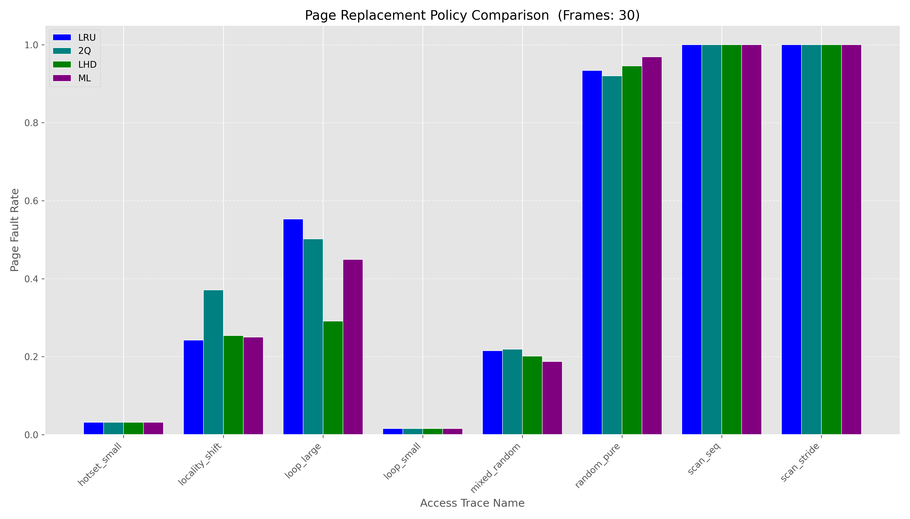
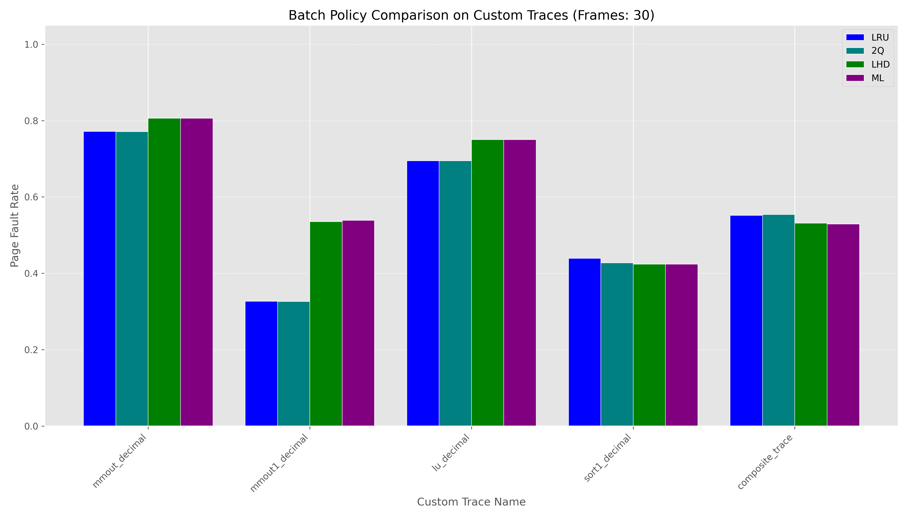

# OS Concepts x ML Practice Project

## Initial Ideas:

1. ML Scheduler
2. ML Page Evictor Policy <--
3. ML Suspicious Process Classifier
4. ML Thread Predictor 

## Selected Project: ML Page Evictor

### Reasoning

1. No necessity modify a kernel
2. More easily implementable simulator
3. Recreatable standard policies for comparison
4. No worrying about race conditions!
5. Concrete and clear reward system for the model's training

### Pre-Research Ideas on Model

#### Live Learning: Multi-armed-bandit approach?

1. Spend some time learning the manner in which pages are accessed and decide a pre-made policy based on what is optimal?

Could also...

2. Spend some time learning how certain pages are accessed--sequentially or randomly--and adapt policy as such. Could create clusters of pages that are sequentially accessed/routinely accessed together. I'm a big fan of using this in model.


3. Non-multi-armed-bandit approach: Choose a predefined policy based on incoming access pattern?

#### Pre-Trained Algorithm?

Seems much less optimal... not adaptive? Not quite sure how this would make good use of ML. Probably would cause less overhead though.

### Plan

1. Research Page Eviction (Refresher) and learn how ML is used with it

2. Create a simulator and add clear support for known policies, such as LRU, FIFO, Random

3. Define the ML problem, goal, and plan for training

4. Train model and adjust along the way

5. Conclusions!

## 1. Research Findings:

### [Learning-based page replacement scheme for efficient I/O processing](https://www.nature.com/articles/s41598-025-88736-4)

#### EELRU - Early Eviction Least Recently Used

ML reaction to cache-size not being large enough for sequential reads to benefit from LRU

#### LPR - Learned Page Replacement

Multi-Armed-Bandit Approach: spend some time learning, then apply optimal learned policy for workload

LPR makes a policy selection after learning phase rather than being a new policy alone

The scheme achieved up to ~62% reduction in execution time in a real out-of-core graph processing case, showing strong performance gains.

### [Enabling Customization of Operating System Memory Eviction Policies](https://er.ucu.edu.ua/server/api/core/bitstreams/8ec6969a-feee-4271-acfc-8d61cc1d820f/content)

#### LHD - Least Hit Density

Removal based on usefulness relative to time spent in cache.

#### MRU - Most Recently Used

Self-explanatory, effective in the case of Sequential page reads followed by random followed by more sequential. A temporary MRU would keep those sequential pages 

#### LFU - Most Frequently Used

LHD without the division

#### LRU-2Q - 2 Queue Least Recently Used

LRU with a queue to track pages which have been accessed multiple times recently.

### Classifying Memory Access Patterns - Multiple Sources

#### [Classifying Memory Access Patterns for Prefetching](https://dl.acm.org/doi/pdf/10.1145/3373376.3378498)
#### [Understanding Memory Access Patterns for Prefetching](https://par.nsf.gov/servlets/purl/10187649)

1. Sequential / scan – contiguous page references
2. Strided / structured – regular non-contiguous spatial accesses
3. Random / irregular – non-local, unpredictable page jumps
4. High-locality / hot-set – strong temporal locality within a small working set
5. Looping / cyclic – pages revisited in regular cycles (repeated strided/sequential)
6. Phase-shift / working-set change – workloads that move between pattern regimes / working sets
7. Moderate locality – partial working-set coverage between hot-set and random 
8. Mixed / multimodal – combinations of the above within one trace

Buckets (For which to define a best cache policy):

0) 1, 2
1) 3
2) 4
3) 5
4) 6, 7
5) 8

## 2. Creating a simulator

### Python Chosen

1. Much more simple to create code for
2. ML integration straightforward (PyTorch)
3. Copious and accessible visualization tools (Matplotlib, Seaborn) help analyze traces, patterns, and miss-rate curves

### Simulator.py

Basic simulator of an operating system’s page-eviction behavior.

The simulator is completely policy-agnostic, acting purely on specified policy.
It maintains all state needed to model demand paging, including:

1. Frame array representing physical memory
2. PageMeta: load time, last access time, access count
3. Page table mapping page IDs to frame indices
4. Counters for hits, faults, and total references

Usage: python simulator.py --frames <N> --policy <name> --trace <file> [--verbose]

A SimulationResult dataclass summarizes the run, reporting hit rate, fault rate, and the final content of the cache.

#### Methods:

access(page_id):
Simulates referencing a single page.

run(trace):
Executes the full sequence of page references.

main:
The main() function provides a simple CLI interface for running the simulator, and...

1. Parses command-line arguments (--frames, --policy, --trace, --verbose)
2. Loads the requested page trace
3. Retrieves the selected eviction policy
4. Instantiates a Simulator
5. Runs the simulation
6. Prints a summary of results
7. (If Verbose): Displays the final cache state and cache state at each access

### Policies.py

Collection of pluggable page-replacement algorithms, each matching a single function signature:

Included policies:

1. FIFO – evict the earliest-loaded page
2. LRU – least recently used
3. MRU – most recently used
4. Random – uniform random eviction
5. LFU – least frequently used
6. LHD – least hit-density (continuous: hits / residency_time)
7. 2Q-style – protects multi-hit pages, ejects one-hit pages
8. ML - Adaptive policy that changes depending on the current memory access window 
  * confidence gating 
  * LHD fallback
  * use of seq_hybrid
  * use of preserve_cache
  * bucket-aware fallbacks
  * policy-switch printing

Policies are registered in a central dictionary so the simulator can select them by name via CLI.

### Traces.py

Provides a set of pluggable trace generators that model a variety of memory-access patterns. These routines are used to benchmark cache-replacement policies, evaluate ML classifiers, and explore locality behavior. Each generator returns a list of integer page IDs suitable for direct input to the simulator.

#### Included Synthetic Trace Generators

1. **loop_small / loop_large**  
   Cyclic access patterns over small or large fixed working sets.  
   Models tight loops and repeated computations with strong temporal locality.

2. **locality_shift**  
   Splits the trace into several segments, each with a distinct, non-overlapping working set.  
   Models abrupt phase changes and working-set replacement.

3. **moving_working_set**  
   Generates a simple shifting window. Each phase selects a new contiguous region and draws uniformly from it.  
   Captures coarse working-set movement but without realistic overlap or temporal correlation.

4. **shifting_working_set**  
   Produces a more realistic drifting working set.  
   Each phase shifts the base address by a small amount, maintaining continuity and gradual locality evolution.  
   Models sliding-window access patterns and iterative workloads where the hot region moves over time.

5. **mixed_random**  
   Implements a hot–cold access model. A small hot subset receives most accesses; the remainder are drawn from a larger cold set.  
   Useful for testing eviction policies under skewed distributions.

6. **random**  
   Uniform random sampling across the full page range.  
   Provides a locality-free baseline and adversarial workload.

#### External Trace Support

If the provided name does not match a predefined trace, it is treated as a file path.  
Trace files may contain:

- One page ID per line, or  
- Space-separated integers

Empty lines and `#` comments are ignored.

## 3. Defining an ML Goal

### Goal: Bélády's Optimal Solution

Though not guaranteeable in reality, my goal is to replace the page that will be accessed furthest in the future, which is the optimal policy (Bélády’s) optimal replacement, using only information available at runtime (past accesses), and compare it to some of the policies built into the simulator.

To strive for Bélády, I plan on training a model to use a similar LPR strategy as described in the research paper cited above. I will train a model that can recognize types of access patterns. This taxonomy will map to the optimal eviction strategy to use. When the model realizes new patterns in the incoming page access stream, it will change the eviction policy as necessary.

I plan on looking into ways I can improve the model beyond simple reactionary policy changes, such as building associations between certain pages as to incentivise keeping clustered pages in the cache even if a policy change hasn't been declared by the model. This might complicate things at a lower level, so this addition is still a hypothetical.

## 4. Building and Training the Model(s)

### ML Access Pattern Classifier

This project uses a small neural network to recognize different memory access patterns online and switch page replacement policies accordingly.

### Access pattern buckets (A–F)

I group windows of recent page references into six high-level buckets:

- **A – Scan / Stride (no reuse)**  
  Mostly sequential or strided forward accesses with almost no repeats.

- **B – Random**  
  Uniform or near-uniform random reads with minimal spatial or temporal locality.

- **C – Tight hot set**  
  Strong temporal locality within a small working set that fits well in cache.

- **D – Looping / cyclic**  
  Repeated traversal of a working set in a loop, possibly larger than the cache.

- **E – Dynamic hot / phase shift**  
  Hot pages embedded in a larger background plus phase changes where the hot region shifts over time.

- **F – Mixed / transition**  
  Ambiguous windows that contain a combination of patterns (e.g., during a change in behavior). When F is detected, the controller keeps the previous stable policy instead of switching immediately.

Each bucket is mapped to an “optimal” concrete policy (MRU, random, 2Q, LHD, etc.) that is better suited for that behavior.

### Feature Vector Definition

In order to start the model, I must determine an informative feature vector for my model to interpret/draw conclusions from during training. This feature vector will incorporate 8 important features of a window of past memory accesses, such as:

#### **1. `unique_ratio`**
Measures the proportion of unique pages in the window.  
High values indicate streaming, random, or shifting behavior; low values indicate strong temporal locality.

#### **2. `repeat_ratio`**
Defined as `1 − unique_ratio`.  
Quantifies how heavily the workload reuses the same pages.

#### **3. `sequential_frac`**
Fraction of adjacent accesses where `page[i+1] == page[i] + 1`.  
Identifies sequential scanning behavior.

#### **4. `stride_small_frac`**
Fraction of adjacent accesses with a small stride (e.g., `|diff| ≤ 4`).  
Captures structured spatial locality, including strided or near-linear patterns.

#### **5. `reuse_mean`**
Mean reuse distance for repeated page accesses.  
Lower values indicate strong temporal locality (hot sets, loops); higher values indicate streaming or random behavior.

#### **6. `reuse_small_frac`**
Fraction of reuse distances ≤ 10.  
Measures short-term temporal locality, distinguishing tight hot sets from larger loops or random behavior.

#### **7. `entropy`**
Entropy of the page-ID distribution in the window.  
High entropy indicates scattered or random access; low entropy indicates concentrated hot sets.

#### **8. `max_run_len`**
Length of the longest consecutive run of the same page.  
Identifies extreme immediate locality (e.g., heavy reuse of one page).

These features summarize spatial structure, temporal locality, and randomness in a compact way that is easy for my small network to learn from and make in-the-moment decisions on.

### Model architecture and training

The classifier is a simple feed-forward network implemented in PyTorch:

- Input: 8-dimensional feature vector  
- Layers: 32 → 32 hidden units with ReLU activations  
- Output: 6 logits (one per bucket A–F)  
- Loss: cross-entropy  
- Optimizer: Adam  
- Training data: ~6k windows generated from synthetic traces that simulate each bucket plus mixed windows for F

The trained weights are stored in `access_pattern_classifier.pt`.

### Online PatternController

At runtime, the `PatternController`:

1. Maintains a sliding buffer of the most recent 50 page references
2. Computes the feature vector for the current window
3. Runs the classifier to predict the most likely bucket (A–F)
4. Smooths predictions over the last few windows to avoid flapping
5. Maps the bucket to a concrete eviction policy:
   - A → MRU  
   - B → random  
   - C → 2Q  
   - D → 2Q  
   - E → LHD  
   - F → keep the last stable policy

The simulator calls `controller.observe(page_id)` on every reference, and the ML-driven `ml` policy queries `controller.current_policy_name()` whenever it needs to evict a page. This allows the cache to adapt dynamically to changes in the access pattern instead of committing to a single static replacement strategy.


## 5. Model Iteration! ML Page Evictor v2: stronger classifier + LHD-gated policy

The first version of the ML page-evictor massively underperformed, especially relative to LHD (Least Hit Density) baseline because the classifier was relatively weak and its decisions always overrode the baseline, even when it was uncertain.

The new version improves this in four ways:

1. **Richer access-pattern features (8 → 16 dims)**  
   The feature extractor now includes:
   - additional stride and jump statistics (mean/std |diff|, backward and
     large-jump fractions),
   - more detailed reuse-distance statistics (mean, std, max, and small
     fraction),
   - and stronger locality descriptors (entropy, top-3 hot-page
     concentration, run-count normalization).  
   This makes it easier for the model to distinguish hot sets, loops,
   phase shifts, random regions, and mixed segments.

2. **Stronger, class-balanced classifier**  
   The access-pattern dataset builder has been updated to:
   - keep the clean A–E pattern windows as before, and
   - downsample the mixed/ambiguous F windows so they no longer dominate
     the training set.  
   The classifier itself is now a deeper MLP (64-64 with batch norm) and
   is trained with inverse-frequency class weights for 40 epochs, which
   significantly improves per-class accuracy, especially on the rarer
   buckets.

3. **Confidence-gated ML policy with LHD fallback**  
   Instead of always overriding the baseline, the ML policy now:
   - defaults to the standard LHD policy,
   - only switches to the scan-aware `seq_hybrid` policy when it is
     highly confident the access pattern is sequential/strided (Bucket A),
   - only freezes the cache (`preserve_cache`) when it is highly
     confident the access pattern is truly random (Bucket B),
   - and otherwise keeps using LHD or the previously chosen stable
     policy.  
   This makes LHD the safety net and uses ML only when it can confidently
   exploit clear patterns, which materially improves performance on
   mixed workloads like the composite trace.

4. **New scan-aware hybrid policy**  
   The ML controller can now route clearly sequential/strided access
   patterns (Bucket A) to a new `seq_hybrid` policy that was not present
   in the original implementation. This policy behaves like LRU while
   the cache is still filling with recently accessed pages (flushing out
   stale data), then switches to MRU once the cache is dominated by
   recent pages to avoid polluting it with one-time streaming accesses.
   In practice, this hybrid behavior gives the ML system a concrete,
   low-level mechanism to exploit scan-heavy regions that LHD alone
   cannot model as directly.

### Confusion Matrix

**Per-class accuracy:**  
A (scan/stride): 1.000 (380/380)  
B (random): 1.000 (380/380)  
C (hot set): 1.000 (380/380)  
D (loop): 1.000 (380/380)  
E (phase shift): 0.997 (379/380)  
F (mixed): 1.000 (180/180)

```
Confusion matrix (rows = true, cols = pred):
            0     1     2     3     4     5
  0:      380     0     0     0     0     0
  1:        0   380     0     0     0     0
  2:        0     0   380     0     0     0
  3:        0     0     0   380     0     0
  4:        0     0     0     0   379     1
  5:        0     0     0     0     0   180
```

### Results Analysis – Generated Traces



The results of this graph are quite to be expected. Since the model was trained on this data, I am glad that its performance was not significantly worse than the very policies I could have chosen from!

Interestingly, the model performed best on the mixed-random trace. In the cases where it lagged slightly behind the classical policies, I would attribute it to the model's warm up period. I think the 192-access window must fill before the classifier can compute its full feature vector. During this early phase, confidence is naturally low, so the policy falls back to LHD by design. Once the window stabilizes, the ML policy makes decisions.

### Results Analysis – Real & Complex Traces



Real trace data used from [University of Toronto - Department of Computer Science](https://www.cs.toronto.edu/~reid/csc150/02f/a2/traces.html)

The real application traces (mmout, mmout1, lu, sort1) exhibit much noisier and more irregular behavior than the synthetic patterns used during training. These workloads contain shifting working sets, large matrix-driven strides, pivot-based recursion, and other behaviors that do not map cleanly to the six bucket types. When viewing some of the data that I trained the model on, I was able to distinguish between different memory access types. Real-world accesses, however, seem to be doing 5 different things at all times, even if the data is only from one process's execution! As a result, the ML classifier rarely reaches high-confidence predictions and therefore spends most of its time falling back to LHD, which limits its ability to differentiate itself from the classical policies.

On the matrix traces (mmout_decimal, mmout1_decimal, lu_decimal), all policies—including ML—see high fault rates simply because the working sets are much larger than the cache and the accesses do not form stable locality regions. After I tried increasing the cache size, there was not much of a difference in relative performance. LHD performs slightly better due to its hit-density mechanism, while ML mirrors LHD closely but cannot surpass it. In sorting (sort1_decimal), the mix of small localized runs and abrupt jumps creates inconsistent short-term locality. Here again, ML behaves similarly to LHD because the classifier does not detect a dominant pattern.

The composite trace is the one real workload where the ML policy performs quite well. It contains some of the structured behavior seen in the generated traces, and the model occasionally identifies these windows with higher confidence. Even so, the trace remains more complex than the training examples, so ML aligns with LHD rather than outperforming it.

Overall, the ML system behaves conservatively on real-world workloads that are too complicated for my training. When patterns are noisy or ambiguous, its confidence gating mechanism keeps it from making aggressive mispredictions, resulting in stable but not superior performance relative to LHD.

## Conclusions

### Further Improvements Discussion

1. Make use of more page metadata
  1) origin of page/type of segment read from
  2) (Increases feature data for potential model training)

2. Adaptive ML Data:
  1) Storage Size Recognition: In the simulator, there isn't a set storage size. Having a defined storage size could help allude to the type of memory accesses that are occuring. For instance, (1, 49, 24, 18) looks a lot more like a working set (rather than random calls) if your storage size is 1M pages than if your storage size is 50.
  2) Page Clustering/Association: Currently, the model only makes decisions based on the current window, however, if was able to recognize certain groups of pages together, it may infer a change in the access pattern earlier than it would under the current model.
  3) ML Pattern Window Size: Even after research, I haven't quite found a consistent hot-pages/working set size (relative to the cache). I have found that cache size plays a vital role in the importance of policy switches, so being able to decide a reasonable cache size relative to both the storage size and typical hot pages size would allow me to choose a goldilocks window size, allowing the model to have enough data before a change is made, as well as not have too small of a scope.
  4) Pattern Frequency Targets: In training the model, I have 6 labeled memory access patterns. Though I am not fully sure how the model treats these patterns in terms of frequency in practice, I think it is reasonable to assume that the model COULD work better if I had more data to inform the model on the typical frequency of each of these patterns. For example, if the model is told that 80% of the time looping reads occur and 20% of the time random reads occur, the model might aim for such a split when it comes to the policy decisions it is making. Currently, though, I provide no data on the relative frequency of the 6 classifications I've defined.

3. Train model on real-world data!

### My Thoughts?

Overall, this project was both educational and enjoyable for me. I was able to take a lot of the topics I had already found interesting from my Operating Systems and Artificial Intelligence classes and dive deeper into related concepts and apply my education. Though my model came up short relative to already-defined policies, I felt the project was very good practice. I enjoyed ideating ways to improve not only the model but also policies, thinking of ways to compromise between the potential of a repeat hot workload after a strided access or the potential of the stride looping. I learned more about iterative model development, as well as data generation. I look forward to potentially revisiting this model to equip it for real-world application better.